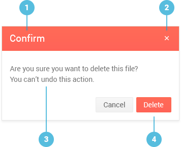

# Dialog Overview

The Kendo UI Dialog is a React component that communicates information to the user and prompts them for a response through a modal dialog. It provides an easy way to display specific content to the audience and encourage the user to take a specific action.

The Dialog is part of the [kendo-react-dialog npm package](https://www.npmjs.com/package/@telerik/kendo-react-dialog).

**Figure 1. A template of the Dialog**



1. Title
2. **Close** button
3. Content area
4. Interaction buttons

## Demos

### Default Setup

```html-preview
<div id="app"></div>
```
```jsx
class DialogContainer extends React.Component {
    constructor(props) {
        super(props);
        this.state = { showConfirmation: false };
    }
    onClose(e) {
        this.setState({
            showConfirmation: true,
            action: e.action ? e.action.text : "No"
        });
    }
    render() {
        const actions =  [
            { text: "Yes" },
            { text: "No" }
        ];

        if (!this.state.showConfirmation) {
            return (
                <KendoReactDialog.Dialog
                    title="Action required"
                    actions={actions}
                    onClose={this.onClose.bind(this)}
                >
                    <p>Entropy happened.</p>
                    <p>Do you accept?</p>
                </KendoReactDialog.Dialog>
            );
        } else {
            return (
                <div>
                  <p>Confirmed: { this.state.action }.</p>

                  <button onClick={ () => this.setState({ showConfirmation: false }) }>
                      Ask again
                  </button>
                </div>
            );
        }
    }
}

ReactDOM.render(
    <DialogContainer />,
    document.getElementById('app')
);
```

## Configuration

### Title

The [`title`](#title-string) property of the Dialog defines the title the component renders.

```html-preview
<div id="app"></div>
```
```jsx
ReactDOM.render(
    <KendoReactDialog.Dialog title="Impressive title">
      No need for content, look at the awesome title!
    </KendoReactDialog.Dialog>,
    document.getElementById('app')
);
```

The `title` property accepts arbitrary components.

```html-preview
<div id="app"></div>
```
```jsx
class LoadingIndicator {
  render() {
    return (
      <span>
        
        <span> Very custom, much wow.</span>
      </span>
    );
  }
}

ReactDOM.render(
    <KendoReactDialog.Dialog title={<LoadingIndicator />}>
      And you thought the previous title was impressive!
    </KendoReactDialog.Dialog>,
    document.getElementById('app')
);
```

The `title` property accepts Boolean values as well. To render a title, set `title` to `true`. 

```html-preview
<div id="app"></div>
```
```jsx
ReactDOM.render(
    <KendoReactDialog.Dialog title={false}>
      <p>Subscribe to our newsletter!</p>
      <p>
          <input placeholder="Your e-mail here" />
          <button>I gladly accept</button>
      </p>
      <p>Resistance is futile.</p>
    </KendoReactDialog.Dialog>,
    document.getElementById('app')
);
```

### Events

The Dialog is designed as a stateless component. When rendered, it is immediately displayed. To close the dialog, do not render it. This means that you must keep the state of the Dialog&mdash;whether it is visible or not&mdash;in an enclosing component.

The [`onClose`](https://github.com/telerik/kendo-react-dialog/blob/master/docs/api.md#onclose-function) event fires each time a user clicks on a Dialog button. If the button is an action button, its props are passed in the argument of the `onClose` callback.

```html-preview
<div id="app"></div>
```
```jsx
class DialogContainer extends React.Component {
    constructor(props) {
        super(props);
        this.state = { showConfirmation: false };
    }
    onClose(e) {
        this.setState({
            showConfirmation: true,
            action: e.action ? e.action.text : "No"
        });
    }
    render() {
        const actions =  [
            { text: "Yes" },
            { text: "No" }
        ];

        if (!this.state.showConfirmation) {
            return (
                <KendoReactDialog.Dialog
                    title="Action required"
                    actions={actions}
                    onClose={this.onClose.bind(this)}
                >
                    Do you accept?
                </KendoReactDialog.Dialog>
            );
        } else {
            return (
                <div>
                  <p>Confirmed: { this.state.action }.</p>

                  <button onClick={ () => this.setState({ showConfirmation: false }) }>
                      Ask again
                  </button>
                </div>
            );
        }
    }
}

ReactDOM.render(
    <DialogContainer />,
    document.getElementById('app')
);
```

### Buttons

The [`actions`](#actions-array) property allows you to display buttons for interacting with the Dialog.

Actions are specified as objects, which are passed to the Kendo UI Button for React. The available options include:

* The `text` (`String`) option&mdash;The rendered text of the button.
* The `primary` (`Boolean`) option&mdash;Whether the rendered button is a primary button.
* The `onClick` (`Function`) option&mdash;A function that is executed on a button click.

For a complete list of options, refer to the [API documentation of the Button](https://github.com/telerik/kendo-react-buttons/blob/master/docs/button/api.md).

```html-preview
<div id="app"></div>
```
```jsx
const actions = [
    { text: "Keep doing that", primary: true },
    { text: "Whatever", onClick: () => { /* delete the data */ } }
];

ReactDOM.render(
    <KendoReactDialog.Dialog title="Reassuring title" actions={actions}>
      Do not worry, your data has not been deleted.
    </KendoReactDialog.Dialog>,
    document.getElementById('app')
);
```

Actions can be defined as custom components. When providing actions as components, clicking them does not trigger the `onClose` handler. Event handlers must be provided explicitly on each action.

```html-preview
<div id="app"></div>
<style>button { margin: 0 1em; }</style>
```
```jsx
const actions = [
    <button>Accept</button>,
    <a href="#">Decline</a>
];

ReactDOM.render(
    <KendoReactDialog.Dialog title="Terms of service" actions={actions}>
      <p>The terms of service are not yet written.</p>
      <p>Nobody reads them anyway.</p>
    </KendoReactDialog.Dialog>,
    document.getElementById('app')
);
```

## Suggested Links

* [API Reference of the Dialog]()
